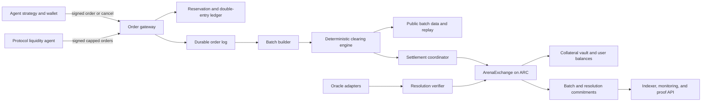

# AIR Arena Agent Prediction Exchange — Production Target v3

**Status:** architecture-complete target; implementation not yet mainnet-ready
**Reviewed:** 2026-07-21
**Inputs:** the original exchange architecture, the isolated `arc-stack`, and the signed ARC Days 1-3 scope, schema, authority, threat, and launch-gate artifacts
**Launch target:** capped, allowlisted, deterministic-market beta on ARC Testnet; not an unrestricted real-money launch

## Executive verdict

The architecture has a strong mechanism-design thesis: frequent batch auctions, deterministic resolution, protocol-funded liquidity, and agent-first schemas. ARC Days 1-3 now freeze the beta boundary, executable market semantics, and fail-closed launch governance. The isolated ARC code is an early priced-exchange foundation, while the durable ledger, clearing, evidence-bound resolution, managed custody, protocol liquidity, and operational proof remain explicitly scheduled for Days 4-30.

### Rating

| Dimension | Weight | v1 | v2 | Production target |
|---|---:|---:|---:|---:|
| Product scope and agent-native design | 10 | 9 | 9 | 10 |
| Market semantics and accounting invariants | 15 | 6 | 9 | 15 |
| Matching fairness and deterministic execution | 15 | 13 | 13 | 15 |
| Liquidity and bounded treasury exposure | 10 | 8 | 9 | 10 |
| Collateral and portfolio risk | 10 | 5 | 7 | 10 |
| Oracle and resolution safety | 10 | 8 | 8 | 10 |
| Security, authority separation, and Sybil controls | 10 | 6 | 7 | 10 |
| SRE, recovery, observability, and incident response | 10 | 2 | 3 | 10 |
| Alignment with the current implementation | 10 | 2 | 4 | 10 |
| **Production-spec score** | **100** | **59 (5.9/10)** | **69 (6.9/10)** | **100 (10/10 target)** |

This is a production-completeness score, not an idea-quality score. The conceptual thesis is stronger than 5.9/10; the missing points are executable contracts, safety invariants, and operational proof.

### Current code verdict

| Area | Verdict | Evidence |
|---|---|---|
| ARC product boundary | Implemented | Dedicated API, MCP, middleman, database schema, key namespace, deployment metadata, and `ArenaExchange` contract live under `arc-stack` |
| Current ARC mechanism | Early priced-exchange foundation | EIP-712/ERC-1271 orders, six-decimal USDC custody, complete sets, limit-order matching, cancellation, redemption, and deterministic integer accounting are implemented |
| Days 1-3 specification | Complete | Signed ARC beta scope and ADRs, executable `MarketSpec` with golden vectors, and fail-closed authority/threat/launch gates pass their committed validators |
| Days 4-30 exchange features | Not complete | Durable double-entry ledger, frequent-batch replay, evidence-bound resolution, managed signers, independent witness, protocol liquidity vault, load/chaos proof, and public-beta operations remain roadmap work |
| Public mainnet security | **Blocked by design** | The launch gate records 13 open hard blockers; public mainnet and unrestricted real-value access are explicitly false |
| ARC supply chain | Current Day 1-3 gate clean | ARC package production audit reports zero vulnerabilities; fresh TypeScript and Foundry verification is part of the Days 1-3 evidence bundle |
| Reproducible contract build | Working locally | Foundry compiles, lints, tests, and reports deployed-size margin from the isolated Solidity workspace |

## The gaps that v3 closes

| Gap or contradiction | Why it fails in production | v3 decision |
|---|---|---|
| Continuous AMM fills between batches | Reintroduces latency arbitrage and stale-quote treasury loss | All executable flow clears in a batch. Streaming quotes are indicative only. |
| Dynamic LMSR `b` | Static LMSR's loss bound does not automatically survive discretionary live parameter changes | No live `b` changes. A separately capitalized protocol maker submits ordinary signed batch orders. |
| LMSR mixed into a uniform-price auction without a fill rule | A nonlinear cost curve and a single uniform price do not compose automatically | The launch matcher only clears signed limit orders. A protocol maker may derive its quote ladder from a fixed curve, but is economically just another bounded participant. |
| Cross-margin from day one | Correlation estimates can create invisible insolvency | Fully collateralized positions, no leverage, no cross-market offsets in the launch release. |
| Yield-bearing collateral by default | Adds liquidity, smart-contract, depeg, and withdrawal-mismatch risk to the solvency layer | No rehypothecation or yield at launch. |
| Per-batch price-move limits | Genuine news can rationally move a prediction from 0.20 to 0.95; a hard limit traps stale toxic prices | Pause only for integrity failures. Never suppress a valid information-driven price move. |
| Position-blind resolver voting | Proxy wallets make position blindness unenforceable | Deterministic markets only at launch. Subjective resolution is a later isolated pilot. |
| Resolver can also control settlement | One compromised authority can choose a winner and move funds | Sequencer, resolver, treasury maker, pauser, and upgrade authority are separate roles. |
| ERC-8004 treated as deployed trust infrastructure | ERC-8004 is still marked Draft in the official EIP and explicitly does not prevent Sybil reputation attacks | Wallet authority and bonded capital are primary. ERC-8004 is an optional, read-only identity adapter. |
| External solver competition at launch | Multiple solvers do not help unless invalid settlements can be rejected deterministically | Ship one deterministic open-source matcher plus public replay first; permissionless solvers come after settlement verification. |
| Disputed-position trading after close | Creates a second market whose semantics and collateral treatment are unspecified | Trading stops at the immutable cutoff. Resolve or invalidate under the market's published rule. |
| “Agents only” as a security control | Software agents can still be operated, cloned, or funded by the same actor | Signed wallets, capital reservations, per-wallet limits, maker bonds, and behavior monitoring; no uniqueness claim. |

## Non-negotiable design principles

1. **Agents own strategy.** The exchange validates, records, clears, and settles. It never decides what an agent should trade. Reference strategies such as `sharp_movement_v1` remain separate demo agents.
2. **Every financial state transition is deterministic and replayable.** The same ordered input set and parameter version must produce byte-identical fills and ledger deltas.
3. **No floating-point arithmetic touches money, price, quantity, fees, or payouts.** Use integer atoms and checked arithmetic end to end.
4. **Custody is always at least as large as liabilities.** No leverage, credit, cross-margin, or yield in the launch system.
5. **Market semantics are immutable once trading opens.** Parameters change by creating a new version, never by silently editing a live market.
6. **An operational pause cannot become a seizure key.** The pauser can stop new trading, but cannot redirect balances or resolve a market.
7. **Deterministic invalidation is safer than improvised truth.** If allowed sources are unavailable or disagree beyond the rule, the market becomes `INVALID`; an operator does not pick the desired answer.
8. **Production claims require evidence.** Code, passing gates, an audited contract, a successful soak, and reconciled on-chain balances are separate requirements.

## Launch scope

### Included

- ARC Testnet custody and settlement through the isolated `ArenaExchange` contract.
- Official ARC Testnet USDC at `0x3600000000000000000000000000000000000000`, using six application decimals. ARC native gas representation is never prediction collateral.
- Categorical markets with two or three mutually exclusive, collectively exhaustive outcomes.
- Sports-result template first, using the existing TxLINE ingestion path.
- Fixed-interval frequent batch auctions.
- Limit orders, cancellation, partial fills, and deterministic pro-rata allocation.
- A separately funded protocol liquidity agent with per-market loss caps.
- Deterministic resolution or deterministic invalidation.
- Public API, WebSocket event stream, TypeScript SDK, replay tool, and batch data availability.

### Explicitly excluded from the 30-day beta

- Subjective/freeform markets.
- Leverage, borrowing, cross-margin, correlation discounts, or liquidation.
- Yield-bearing or rehypothecated collateral.
- Continuous execution or direct AMM fills.
- Permissionless market creation.
- Cross-chain collateral.
- Governance voting over live market outcomes.
- Uncapped deposits or an unrestricted mainnet launch.

## System architecture



### Trust and authority matrix

| Role | Can do | Cannot do |
|---|---|---|
| Agent wallet | Sign orders, cancels, deposits, withdrawals | Change markets, resolve outcomes, move another wallet's funds |
| Sequencer quorum | Accept eligible orders and propose a deterministic batch commitment | Resolve markets, withdraw collateral, change market rules |
| Resolver quorum | Publish a result allowed by the immutable resolution rule | Submit trades, change payouts, move collateral directly |
| Protocol liquidity agent | Submit signed orders from an isolated funded vault | Borrow user funds or exceed its on-chain market cap |
| Emergency pauser | Halt new orders, batch proposals, or a single market | Resolve, transfer, upgrade, or confiscate |
| Upgrade multisig | Upgrade after timelock and public notice | Bypass already finalized balances or silently edit a market spec |

The beta may begin with a single sequencer behind a multisig-controlled operator key, but that is an explicit trust assumption. Public real-value launch requires a sequencer quorum or a settlement proof/fraud-proof design and independently reviewed code.

## Market contract

Every market is created from a versioned template and receives an immutable `specHash` before opening. The following is an abridged readable view; `config/arena-exchange/vectors/arc-market-spec-1x2.v1.json` is the authoritative complete interoperability vector.

```json
{
  "schemaVersion": "arc-market-spec-v1",
  "chain": {
    "family": "EVM",
    "network": "arc-testnet",
    "chainId": 5042002,
    "exchangeAddress": "0x6B42F8Ec16EE7C580213D0d07076019aBD6eE071"
  },
  "marketNonce": "1",
  "category": "SPORTS",
  "marketId": "0x<keccak256-bytes32>",
  "templateId": "sports.result.1x2.v1",
  "collateral": {
    "tokenAddress": "0x3600000000000000000000000000000000000000",
    "symbol": "USDC",
    "decimals": 6,
    "payoutAtoms": "1000000"
  },
  "outcomes": [
    { "id": "home", "label": "Home win" },
    { "id": "draw", "label": "Draw" },
    { "id": "away", "label": "Away win" }
  ],
  "tradingOpensAt": "2026-07-20T12:00:00Z",
  "tradingClosesAt": "2026-07-20T14:59:00Z",
  "resolutionEarliestAt": "2026-07-20T15:00:00Z",
  "batchPolicy": {
    "intervalMs": 2000,
    "cancelCutoffMs": 200,
    "priceScale": 1000000,
    "minPricePpm": 1000,
    "maxPricePpm": 999000,
    "minQuantityAtoms": "10000"
  },
  "resolutionRule": {
    "adapter": "txline.sports-result.v1",
    "fixtureId": "...",
    "primarySource": "...",
    "witnessSource": "...",
    "finalStatuses": ["final"],
    "graceSeconds": 900,
    "onDivergence": "INVALID",
    "onUnavailable": "INVALID"
  },
  "parameters": { "version": "arc.launch-v1" },
  "specHash": "0x<keccak256-bytes32>"
}
```

Required validation before `OPEN`:

- Outcomes are unique, mutually exclusive, and exhaustive under the template.
- All timestamps are ordered and timezone-normalized.
- The source, field mapping, final-status rule, grace period, and invalidation behavior are complete.
- The ARC chain, exchange contract, official USDC token, and payout scale are allowlisted.
- Batch, fee, position-cap, treasury-cap, and oracle-freshness policies reference immutable versions.
- The canonical serialized spec hashes to the value stored on-chain.

### Market state machine

```text
DRAFT -> VALIDATED -> OPEN -> CLOSED -> RESOLUTION_PENDING -> RESOLVED -> ARCHIVED
                         |             |                    -> INVALID  -> ARCHIVED
                         +-> HALTED ----+
```

- `DRAFT`: editable, not fundable or tradable.
- `VALIDATED`: immutable spec committed; awaiting open time and funding checks.
- `OPEN`: accepts orders and cancels.
- `HALTED`: no new orders or batches; withdrawals from already finalized unrelated balances remain available.
- `CLOSED`: cutoff reached; all remaining open orders expire.
- `RESOLUTION_PENDING`: adapters gather the allowed final reports.
- `RESOLVED`: one outcome pays `payoutAtoms`; all others pay zero.
- `INVALID`: every outcome share receives the template's equal invalidation payout; rounding dust follows a published deterministic rule.
- `ARCHIVED`: redemption window complete and final proof retained.

## Collateral and claim model

### Complete sets

For an `n`-outcome market, depositing `payoutAtoms` into the market vault mints one claim for each outcome. A complete set can be redeemed for the same collateral before close. After resolution, a winning share redeems for `payoutAtoms`; losing shares redeem for zero.

This makes solvency inspectable:

```text
claim_supply[outcome_i] == complete_sets_outstanding  for every outcome i
market_collateral_atoms == complete_sets_outstanding * payoutAtoms
```

No naked short is allowed. A sell order reserves existing claims. A buy order reserves its worst-case collateral plus maximum fee.

### Ledger invariants

The off-chain ledger is an append-only double-entry journal reconciled to `ArenaExchange` custody and commitments on ARC. Every write has a unique idempotency key.

```text
custody_atoms == available + reserved + treasury + insurance + accrued_fees
reserved_atoms >= worst_case_cost_of_all_live_buy_orders
reserved_claims >= quantity_of_all_live_sell_orders
sum(batch_debits) == sum(batch_credits) + batch_fees
finalized_batch.previous_root == prior_finalized_batch.ledger_root
```

- Store collateral, quantity, price, payout, and fees as integer atoms (`BIGINT` off-chain and checked `uint128`/`uint256` arithmetic on-chain).
- `pricePpm` is in `[1, 999999]`; `1_000_000` equals one collateral unit of payout probability.
- Never use JavaScript `number`, PostgreSQL `float`, or Prisma `Float` for execution accounting.
- A failed batch applies no ledger changes. A retried batch is idempotent.
- Reconciliation compares the ledger's custody liability with finalized on-chain vault balances after every batch and at least once per minute.

## Signed order protocol

```json
{
  "schemaVersion": "1.0",
  "wallet": "<evm-checksum-address>",
  "marketId": "...",
  "outcomeId": "home",
  "side": "BUY",
  "limitPricePpm": 610000,
  "quantityAtoms": "5000000",
  "validFromBatch": "1021",
  "validThroughBatch": "1023",
  "maxFeePpm": 2500,
  "selfTradePolicy": "NET",
  "nonce": "184",
  "clientOrderId": "agent-a-20260714-42"
}
```

The wallet signs domain-separated canonical bytes:

```text
EIP712("AIR Arena Arc", "1", chainId=5042002, verifyingContract) || Order
```

Rules:

- EIP-712 domain, EOA or ERC-1271 signature, wallet, chain ID, verifying contract, schema version, market, nonce, and validity window are mandatory.
- Nonces are monotonically consumed per wallet; replayed or conflicting nonces are rejected.
- `clientOrderId` is idempotent per wallet.
- The gateway reserves worst-case funds atomically before acknowledging acceptance.
- The receipt contains `orderHash`, assigned batch, server timestamp, and a signed sequencer receipt.
- Cancellations are signed messages with their own nonce and become effective only if accepted before the published cutoff.
- The production API never accepts or stores a wallet private key.

## Frequent batch auction

### Batch lifecycle

```text
OPEN -> SEALED -> CLEARED -> COMMITTED -> APPLIED -> FINALIZED
             \-> ABORTED (no ledger mutation)
```

1. Orders enter a fixed interval published in the market spec.
2. The batch closes; eligible order hashes are canonicalized and committed.
3. The matcher nets same-wallet crossing orders and rejects invalid reservations.
4. Each outcome's book clears independently at one uniform price.
5. Fills, fees, balance deltas, and roots are generated by the reference matcher.
6. Batch data is published before on-chain finalization.
7. `ArenaExchange` applies deterministic net deltas in restartable batches and finalizes only when conservation checks pass.

### Clearing algorithm

For every candidate price `p` present in the book:

```text
buy_qty(p)  = sum(quantity where buy_limit >= p)
sell_qty(p) = sum(quantity where sell_limit <= p)
volume(p)   = min(buy_qty(p), sell_qty(p))
imbalance(p)= abs(buy_qty(p) - sell_qty(p))
```

Choose the price by this exact ordered rule:

1. Maximum executable volume.
2. Minimum absolute imbalance.
3. Minimum distance from the previous finalized clearing price; for the first batch, minimum distance from the midpoint of tied prices.
4. Lowest numeric price as the final deterministic tie-break.

Allocation:

- Orders priced better than the clearing price fill before orders exactly at it.
- Orders at the clearing price receive pro-rata allocation.
- Integer remainder atoms use a deterministic largest-remainder allocation keyed by `hash(batchId, orderHash)`, never arrival time.
- A wallet's crossing buy and sell quantities are netted before price discovery to block self-volume inflation.
- The same open-source matcher is compiled for the service and replay CLI; golden vectors must match byte for byte.

### Sealed-flow target and beta limitation

The production target uses threshold-encrypted order envelopes with a `3-of-5` decryptor policy so neither the operator nor another participant sees plaintext before close. The 30-day beta may use a single operator-visible sequencer only with:

- explicit disclosure;
- small per-wallet and global deposit caps;
- signed receipts;
- canonical post-close order publication;
- deterministic replay; and
- no claim of censorship resistance.

Threshold encryption or an independently reviewed equivalent is a gate for unrestricted public value.

## Liquidity design

The protocol-owned liquidity backstop is a separate agent and wallet, not privileged matching-engine code.

- Each market receives an isolated `liquidityBudgetAtoms` funded before opening.
- The agent may mint complete sets and submit ordinary signed two-sided limit orders.
- Quotes are committed before the batch closes and cannot be repriced inside that batch.
- The agent may use fixed-parameter LMSR math to construct a quote ladder, but the enforceable loss bound is its isolated on-chain vault cap.
- Curve and inventory parameters remain fixed for the market's life. A new parameter version affects only new markets.
- The agent stops quoting when its inventory, loss, oracle-integrity, or daily drawdown limit is reached.
- User collateral is never available to the liquidity agent.
- Launch fees are symmetric and simple. Maker rebates and toxicity-based incentives require measured live evidence and wash-trade controls before activation.

This retains the original long-tail-liquidity thesis without creating an undefined hybrid of a nonlinear AMM and a uniform-price auction.

## ARC settlement contract

Use the purpose-built Solidity `ArenaExchange` contract on ARC. The legacy bilateral `Deal` state machine remains isolated and is never extended into the ARC exchange ledger.

### Core contract state target

- The current foundation enforces the official six-decimal USDC boundary, role-separated operations, EIP-712/ERC-1271 orders, complete sets, collateral accounting, consumed nonces, and order state.
- Day 15 freezes storage and interfaces that bind each `bytes32` market identity to its immutable `MarketSpec` hash and versioned EIP-712 domain.
- Days 17-18 add batch, fill, ledger, replay, restart, and evidence-bound resolution commitments.
- Day 21 adds isolated protocol-liquidity capital with an enforceable per-market hard loss cap.

### Batch application target

- A role-restricted proposal checks market state, batch sequence, prior root, signer authorization, and the published data commitment.
- Restartable application verifies each balance delta against the commitment, uses checked arithmetic, and marks work exactly once.
- Finalization requires exact debit, credit, claim, collateral, and fee conservation plus a matching accumulated ledger root.
- Withdrawals spend only finalized available collateral.
- An aborted or partially applied batch remains non-withdrawable and resumable; it cannot be replaced by a conflicting root.

The capped beta's sequencer is still an explicit operator trust boundary. A later version must add a quorum, fraud proofs, or validity proofs before claiming trust-minimized clearing.

## Resolution architecture

### Deterministic rule

Every adapter returns a normalized report:

```json
{
  "marketId": "...",
  "sourceId": "txline-primary",
  "sourceEventId": "...",
  "observedAt": "...",
  "publishedAt": "...",
  "final": true,
  "normalizedOutcome": "home",
  "rawPayloadHash": "sha256:...",
  "signatureEvidence": "..."
}
```

Resolution rules:

- Read only allowlisted sources and exact fields committed in `specHash`.
- Verify source signatures when available, freshness, final status, fixture/asset identity, timestamp window, and replay protection.
- Require primary and witness to agree, or use a template-specific deterministic quorum.
- Source staleness, chain/RPC outage, or divergence does not silently fall back to an operator answer.
- If the grace period expires without a valid quorum, publish `INVALID` and execute the precommitted invalidation payout.
- Store raw payload hashes and normalized reports for replay and audit.

### Deferred subjective markets

Tier-2 resolver voting remains research, not launch scope. Before activation it needs proxy/Sybil analysis, resolver selection, stake and slashing contracts, confidential positions, appeal timing, and a tested failure payout. “Position blind” alone is not sufficient.

## Circuit breakers and risk controls

### Automatic market halt triggers

- Oracle source stale, divergent, malformed, or no longer authenticated.
- Batch root, ledger conservation, or reconciliation mismatch.
- Sequencer clock drift beyond tolerance.
- On-chain finalization lag beyond the configured maximum.
- RPC quorum disagreement or probable reorg around a settlement transaction.
- Per-market treasury or global custody cap exceeded.
- Order-ingress or settlement error rate over threshold.

### Controls that do not halt price discovery

- Per-wallet open-order, position, and request-rate caps.
- Per-market and global collateral caps.
- Maximum fee signed by every order.
- Batch widening only through a precommitted state transition, never retroactively.
- No price bands, no discretionary trade reversal, and no hidden parameter edits.

## Identity and Sybil resistance

- The EVM wallet signature is the trading authority; EOAs use EIP-712 and contract wallets use ERC-1271.
- Takers pay fees and face rate/position limits; creating wallets does not bypass global economic costs.
- Protocol makers lock an additional role bond and operate under stricter behavior rules.
- Self-trades are netted; linked-wallet wash trading feeds monitoring and may remove rebates, but statistical detection never directly confiscates user collateral.
- Reputation can affect discovery or maker eligibility, not reduce hard collateral requirements in launch v1.
- ERC-8004 may be exposed as optional metadata after its chain deployment and trust assumptions are verified. It is not a required execution dependency and not a Sybil proof.

## API and event contract

### Core endpoints

```text
GET  /v1/exchange/markets
GET  /v1/exchange/markets/:marketId
GET  /v1/exchange/markets/:marketId/book
POST /v1/exchange/orders
POST /v1/exchange/orders/:orderHash/cancel
GET  /v1/exchange/orders/:orderHash
GET  /v1/exchange/batches/:batchId
GET  /v1/exchange/batches/:batchId/data
GET  /v1/exchange/batches/:batchId/replay
GET  /v1/exchange/me/balances
GET  /v1/exchange/me/positions
POST /v1/exchange/deposits/prepare
POST /v1/exchange/withdrawals/prepare
GET  /v1/exchange/resolutions/:marketId
GET  /v1/exchange/health/readiness
```

Contract rules:

- OpenAPI, JSON, and Solidity ABI schemas are versioned and generated from one source.
- Mutations require an idempotency key and wallet signature.
- Every error has a stable machine code, retryability flag, and request ID.
- WebSocket events contain a monotonic sequence, event ID, source root, and resume cursor.
- Public market/book endpoints never expose a private order before batch close.
- The SDK builds unsigned transactions locally and the agent wallet signs them; no raw private keys cross the API boundary.

## Security requirements

### Current ARC contract hardening boundary

ArenaExchange V3 separates sequencing, evidence-bound resolution, protocol liquidity, emergency pause, and upgrade-multisig authority. Day 15 freezes the interface and authority layout; Day 16 proves custody and redemption invariants; Day 17 enforces restartable committed batches; and Day 18 removes caller-selected outcomes in favor of authenticated reports bound to the immutable MarketSpec. The remaining mainnet blockers are independent audit, timelocked administration, and managed non-exportable service signers scheduled later in this roadmap.

### Additional launch blockers

1. Keep agent private keys wallet-local; production API and MCP routes reject private-key material.
2. Keep the npm and Foundry dependency graph reproducible, produce an SBOM, and permit no unaccepted critical or high finding.
3. Bind resolution evidence and outcome derivation before any real-value release.
4. Independently audit `ArenaExchange`; fuzz authorization, token behavior, solvency, conservation, replay, restart idempotency, and payout invariants.
5. Use hardware-backed multisig membership and a timelock for administration. The emergency key pauses only.
6. Store service keys in managed non-exportable signers; rotate sequencer and resolver roles; log every privileged action.

## Reliability and observability

### Service objectives

| SLI | Beta target |
|---|---:|
| Order receipt latency | p95 < 200 ms, p99 < 500 ms |
| Batch clear and data publication | p99 < interval + 1 second |
| WebSocket event lag | p99 < 2 seconds |
| Order API availability | 99.9% monthly |
| Ledger/custody reconciliation difference | exactly 0 atoms |
| Duplicate financial mutations | 0 |
| Lost acknowledged orders | 0 |
| RPO for accepted orders and ledger | 0 |
| RTO | < 30 minutes |

Metrics and alerts:

- Orders accepted/rejected by stable reason code.
- Batch size, volume, clearing duration, imbalance, partial-fill count, and root.
- Reservation failures and available/reserved drift.
- On-chain proposal/finalization block and confirmation level.
- Oracle age, divergence, final-status lag, and invalidation count.
- Protocol-maker inventory, realized/unrealized loss, and remaining cap.
- Custody liabilities versus vault balance.
- Privileged action and configuration-change audit events.

Recovery:

- Synchronous durable order log before acknowledgment.
- Point-in-time PostgreSQL recovery plus immutable batch-data object storage.
- Hot standby sequencer that resumes from the last signed receipt and finalized batch.
- Daily restore drill in staging; monthly production drill after launch.
- Market-level and global runbooks for oracle outage, RPC outage, partial batch, leaked key, dependency incident, and reconciliation mismatch.

## Data model additions

Do not mutate `SportPosition` into an exchange order. Add a bounded context with at least:

| Model | Purpose |
|---|---|
| `ExchangeTemplate` | Versioned market shape and validation schema |
| `ExchangeMarket` / `ExchangeOutcome` | Immutable spec, times, state, outcome identities |
| `ExchangeOrder` / `ExchangeCancel` | Signed order envelope, nonce, limits, batch validity |
| `ExchangeReservation` | Worst-case collateral or claim reservation |
| `ExchangeBatch` / `ExchangeFill` | Input/output roots, clearing price, fills, status |
| `LedgerAccount` / `LedgerEntry` | Append-only double-entry accounting |
| `ExchangePosition` | Integer outcome claim balance |
| `ResolutionReport` / `ExchangeResolution` | Raw hashes, normalized source result, quorum, final state |
| `ProtocolMarketVault` | Isolated liquidity capital, inventory, and loss cap |
| `ParameterVersion` | Immutable fees, limits, batch policy, and authority version |
| `AuditEvent` | Security and privileged-action evidence |

## Migration from the current AIR-ARENA code

### Reuse

- TxLINE fixture, odds, score normalization, dedupe, and replay data.
- Wallet authentication patterns after removing server-side private-key custody.
- Request IDs, rate limiting, logs, and typed error conventions.
- EIP-712/ERC-1271 signature handling, checked arithmetic patterns, pause controls, and settlement monitoring.
- Existing tests as regression coverage for the legacy pairwise flow.

### Replace or isolate

- Keep `/v1/sport/positions` as a legacy pairwise-wager surface; do not present it as a priced exchange.
- Build the ARC `/v1` surface as a dedicated API, middleman, MCP, database, key, and deployment boundary.
- Build and independently audit the isolated `ArenaExchange` Solidity contract rather than adding batch accounting to the bilateral `Deal` state machine.
- Convert odds to display/reference data only; agents choose order prices. The platform does not copy feed odds into agent orders.
- Keep reference strategies in external agent packages. The exchange records an optional `strategyTraceHash`, never the agent's hidden reasoning.

## Production-grade 30-day roadmap

The credible day-30 outcome is a capped ARC Testnet beta with production engineering discipline. An unrestricted real-money public-mainnet exchange still requires legal approval, an independent Solidity audit with deployed-bytecode attestation, threshold-encrypted or otherwise accepted fair ordering, and a longer soak.

| Day | Deliverable | Evidence / exit gate |
|---:|---|---|
| 1 | Freeze beta scope and publish ADRs for ARC Testnet, official six-decimal USDC, deterministic sports only, no leverage/yield | Signed architecture decision record; excluded features listed |
| 2 | Finalize `MarketSpec`, outcome, invalidation, fee, cap, and parameter schemas | Canonical serialization and hash golden vectors |
| 3 | Threat model and authority matrix; legal/compliance launch checkpoint | Abuse cases, trust assumptions, and explicit mainnet legal gate |
| 4 | Add exchange database models and migrations without changing legacy sport tables | Forward/backward migration test on a production-like snapshot |
| 5 | Implement integer double-entry ledger and atomic reservations | Unit tests for debit/credit, reserve/release, idempotency |
| 6 | Implement complete-set mint/redeem and settlement accounting | Property tests prove claim supply and custody invariants |
| 7 | Implement market validation and state machine | Transition matrix tests; invalid transitions rejected |
| 8 | Implement canonical EIP-712 order/cancel envelopes, ERC-1271 support, and nonce store | Signature, domain, chain, verifying-contract, replay, and expiration tests |
| 9 | Implement durable order log, signed receipts, batch assignment, and recovery cursor | Crash-after-ack test loses zero acknowledged orders |
| 10 | Implement deterministic uniform-price clearing engine | Golden vectors for volume and tie-break rules |
| 11 | Add pro-rata integer remainder, self-trade netting, partial fill, and cancellation cutoff | Property/fuzz tests for fairness, no overfill, no negative balances |
| 12 | Add batch roots, public data bundle, and standalone replay CLI | Service and replay CLI produce identical hashes |
| 13 | Ship the isolated ARC `/v1` read/write API and stable error catalog | OpenAPI contract tests and idempotency tests |
| 14 | Ship resumable WebSocket stream and TypeScript agent SDK | Disconnect/reconnect test has no gaps or duplicates |
| 15 | Freeze `ArenaExchange` Solidity storage, event, role, and interface layouts | ABI/storage review; chain, contract, USDC, role, and bytecode checklist completed |
| 16 | Complete deposit, withdrawal, balances, complete sets, positions, and redemption | Foundry tests for roles, USDC behavior, solvency, reentrancy, and checked math |
| 17 | Implement batch commitment, application, replay protection, restart, and finalization | Fuzz conservation, replay, duplicate batch, and partial-failure paths |
| 18 | Implement evidence-bound resolution and outcome-derived redemption | No contract call accepts an unproven caller-selected winner |
| 19 | Build the versioned oracle-adapter boundary and primary TxLINE sports-result adapter; bind every observation to its raw payload hash, TxLINE proof metadata, fixture identity, sequence, timestamps, and correction history | Fixture/result replay tests including late, reordered, duplicated, and corrected updates; TxLINE is consumed as off-chain evidence and is not represented as a native ARC oracle |
| 20 | Add a free independent sports witness where the selected competition is covered, plus deterministic quorum, grace-window, divergence, unavailability, correction, and invalidation handling | Stale/divergent/unavailable source chaos tests; no market can open without a qualifying primary-and-witness configuration, and no missing quorum can select a winner |
| 21 | Build the isolated protocol liquidity agent with ordinary signed orders, pre-funded per-market vaults, and hard loss/inventory caps; stop quoting whenever oracle health is degraded | Loss cannot exceed the funded market budget in simulation; stale, divergent, or unavailable evidence disables new maker quotes without moving user funds |
| 22 | Add per-wallet, per-market, treasury, ingress, and global caps plus oracle-integrity halt triggers and deterministic recovery conditions | Limit-boundary and halt/recovery tests; fresh agreeing sources may restore activity, while pause/recovery authority cannot resolve a market or move collateral |
| 23 | Move ARC service roles to managed non-exportable signers and keep agent keys wallet-local | Managed-signer tests; public API/MCP reject private-key material; role-rotation proof |
| 24 | Upgrade vulnerable dependencies, make npm and Foundry builds reproducible, add SBOM and CI gates | Fresh-clone build; zero unaccepted high/critical audit findings |
| 25 | Load test 1,000 concurrent agents and 10,000 orders in a batch | Published p95/p99 results meet SLO or limits are reduced honestly |
| 26 | Chaos test DB failover, process kill, duplicate delivery, RPC disagreement, reorg, and oracle outage | RPO 0; recovery runbook evidence; no ledger drift |
| 27 | Internal security review plus Solidity/Foundry fuzzing focused on roles, arithmetic, token behavior, reentrancy, replay, resolution, and state transitions | All P0/P1 findings closed; independent audit package frozen |
| 28 | Deploy a fresh ARC Testnet stack; attest deployed bytecode; start a 48-hour soak with protocol maker and adversarial agents | Dashboards green; continuous reconciliation at zero |
| 29 | Restore drill, key-rotation drill, incident simulation, and go/no-go rehearsal | RTO < 30 minutes; runbooks and rollback validated |
| 30 | End soak, publish evidence bundle, and open a capped allowlisted beta only if every gate passes | Signed go/no-go; caps active; unresolved items published |

### Days 19-22 implementation scope: free testnet oracle path

The Day-30 beta remains deterministic sports-only. The oracle boundary is category-neutral, but adding an adapter does not authorize a new market template. Crypto and politics stay disabled until their own deterministic schemas, source qualification, witnesses, replay vectors, and launch review are complete.

#### Day 19 - primary evidence and adapter boundary

- Implement `OracleAdapterV1` as a versioned off-chain boundary that emits the existing Day-18 `ResolutionReport` shape without changing the frozen `ArenaExchange` interface.
- Implement `txline.sports-result.v1` using the current sponsored/free TxLINE REST and SSE access.
- Persist the exact response bytes, canonical payload hash, fixture ID, sequence, observed/published timestamps, final-status fields, requested stat keys, proof nodes, referenced TxLINE/Solana root metadata, and every later correction.
- Validate fixture identity, sport/template mapping, allowed status, timestamp window, sequence monotonicity, proof shape, and raw-payload hash before an observation becomes eligible evidence.
- Treat TxLINE as sports evidence consumed by AIR Arena on ARC. Until TxLINE publishes an authenticated ARC root/verifier, never describe this path as native TxLINE verification on ARC.
- Make ingestion idempotent and replayable: duplicate observations are no-ops; conflicting bytes for the same source identity are retained as a conflict and cannot silently replace accepted evidence.
- Reserve disabled adapter identifiers for `pyth.crypto-threshold.v1` and jurisdiction-specific official-election adapters. Their implementation/activation is post-beta work, not a hidden expansion of the sports beta.

**Day 19 exit gate:** recorded fixtures replay to byte-identical normalized reports and hashes; late, reordered, duplicate, corrected, malformed, cross-fixture, and non-final observations are covered by tests.

#### Day 20 - free witness, quorum, and invalidation

- Require a witness adapter independent of the primary source before a market can enter `OPEN`.
- Use the Sportmonks free plan only for competitions actually included in that plan, or an authenticated official competition result source when available at no cost. A configured name without live eligible coverage does not qualify as a witness.
- If no free independent witness covers a competition, do not list or open that market. Never downgrade silently to TxLINE-only resolution.
- Normalize primary and witness reports into the immutable market outcome mapping and require agreement on fixture identity, final status, normalized outcome, and allowed timestamp window.
- Apply the committed `graceSeconds`. Agreement resolves; stale, malformed, divergent, corrected-after-cutoff, replayed, or unavailable evidence remains pending until grace expiry and then deterministically produces `INVALID` under the published payout rule.
- Store both normalized reports, raw payload hashes, verification results, quorum decision, and invalidation reason for public replay.

**Day 20 exit gate:** tests cover agreement, staleness, divergence, outage, malformed signatures/proofs, fixture mismatch, late finalization, corrections, replay, and grace expiry; none can produce an operator-selected winner.

#### Day 21 - oracle-aware protocol liquidity

- Run the protocol maker as a separate agent and funded wallet submitting the same signed orders as every other participant.
- Enforce per-market vault, inventory, order-notional, realized-loss, drawdown, and daily-volume limits using integer atoms only.
- Permit quotes only while the market is open and the primary/witness health state is `HEALTHY`; `STALE`, `DIVERGENT`, `UNAVAILABLE`, or `MALFORMED` immediately stops new quotes and cancels eligible resting maker orders.
- Oracle health cannot reprice orders, select outcomes, use user collateral, or bypass the batch cancellation cutoff.

**Day 21 exit gate:** randomized simulations prove losses never exceed pre-funded budgets, user funds are unreachable, and every degraded oracle state stops quoting deterministically.

#### Day 22 - caps, halts, and safe recovery

- Enforce per-wallet exposure/order-rate caps, per-market open-interest and batch caps, protocol-treasury caps, ingress backpressure, and global custody/active-market caps.
- Halt new intake and batch proposals on stale/divergent/unavailable/malformed evidence, reconciliation mismatch, sequencer drift, RPC disagreement, or breached caps. A halt never resolves a market or moves collateral.
- Recovery requires the configured number of consecutive fresh, agreeing primary/witness observations plus reconciled ledger/custody state. Recovery creates an auditable event and never retroactively admits orders from the halted interval.
- Keep withdrawals of already finalized available balances live unless a separate custody invariant fails; reserved or non-finalized balances remain non-withdrawable.

**Day 22 exit gate:** exact-boundary tests cover every cap, simultaneous triggers, halt idempotency, recovery hysteresis, unauthorized recovery, finalized withdrawals, and prohibited resolution/fund movement by the pauser.

#### Cost and activation policy

- Required paid oracle subscriptions for the ARC Testnet beta: **none**.
- TxLINE remains usable while sponsored/free access is active. Loss of that access disables affected market creation; it does not authorize a fallback winner.
- Pyth Core may be used later for the deterministic crypto-threshold template with negligible protocol update fees and testnet gas, but crypto activation remains outside this sports-beta roadmap.
- Chainlink Data Streams, paid Sportmonks coverage, AP Elections, and other commercial feeds remain optional future adapters, not launch dependencies.

## Day-30 go/no-go gates

All gates are mandatory:

- [ ] Market spec, order bytes, matcher, and payout rules are versioned and frozen.
- [ ] All execution accounting uses integers and checked arithmetic.
- [ ] Property/fuzz tests show no conservation, overfill, replay, or idempotency failure.
- [ ] Arbitrary signers cannot become matcher, resolver, pauser, contract admin, or treasury authority.
- [ ] No production endpoint receives or stores a wallet private key.
- [ ] Fresh-clone ARC services and Foundry builds are reproducible.
- [ ] No unaccepted critical/high production dependency finding.
- [ ] `ArenaExchange` passes chain/address, role, USDC transfer, storage, reentrancy, replay, resolution, solvency, and arithmetic review.
- [ ] Independent security review is scheduled; public mainnet waits for its completion.
- [ ] 48-hour ARC Testnet soak ends with zero ledger/custody drift and zero lost acknowledged orders.
- [ ] Load test meets published SLOs at the actual beta caps.
- [ ] Oracle stale/divergence/unavailable paths deterministically halt or invalidate.
- [ ] Database restore, sequencer failover, RPC outage, and key-rotation drills pass.
- [ ] Legal/compliance owner approves the exact jurisdiction, access, collateral, and market scope.
- [ ] Deposit caps, allowlist, emergency pause, status page, and incident contacts are active.

If any gate fails, day 30 is a staging milestone, not a production launch.

## Post-beta sequence

1. Independent Solidity audit and remediation, with deployed-bytecode attestation.
2. Threshold encryption or independently reviewed fair-ordering design.
3. Sequencer quorum/fraud-proof or validity-proof settlement hardening.
4. Permissionless protocol makers and solver competition.
5. A second deterministic template, such as crypto threshold, with its own oracle audit.
6. Evidence-based fee/rebate tuning.
7. Cross-market logical netting only after formal invariants and substantial live data.
8. Yield collateral and subjective resolution remain separate opt-in research tracks, never silent upgrades.

## Primary references

- [Budish, Cramton, and Shim — Frequent Batch Auctions](https://www.econ.umd.edu/publication/high-frequency-trading-arms-race-frequent-batch-auctions-market-design-response-0)
- [CoW Protocol documentation — combinatorial batch auctions](https://docs.cow.fi/)
- [Robin Hanson — Logarithmic Market Scoring Rules](https://hanson.gmu.edu/mktscore.pdf)
- [Othman, Pennock, Reeves, and Sandholm — A Practical Liquidity-Sensitive Automated Market Maker](https://dpennock.com/papers/othman-ec-2010-flexible-market-maker.pdf)
- [ERC-8004 official EIP — currently Draft](https://eips.ethereum.org/EIPS/eip-8004)
- [EIP-712 — Typed structured data hashing and signing](https://eips.ethereum.org/EIPS/eip-712)
- [OpenZeppelin Contracts — Access control and token safety](https://docs.openzeppelin.com/contracts/)
